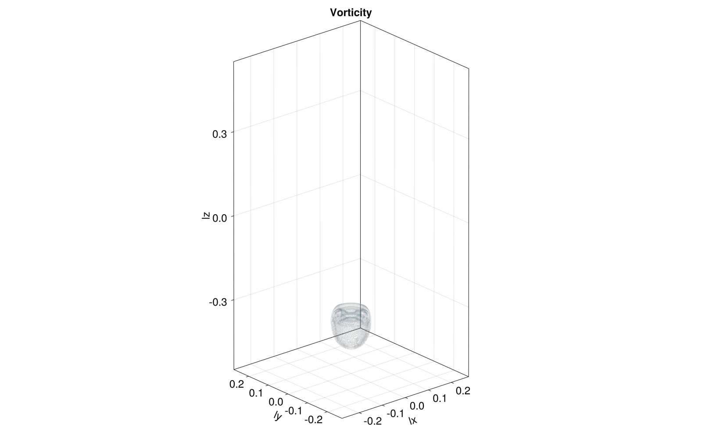
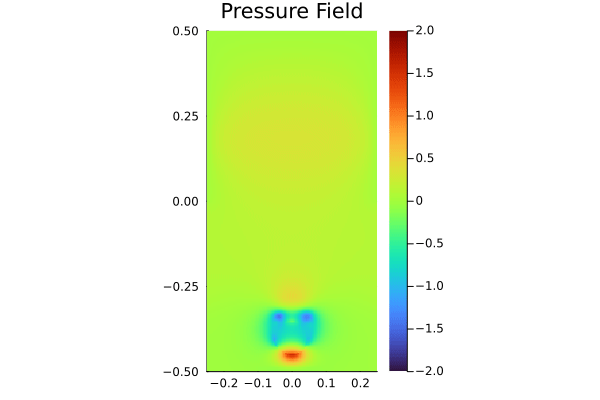
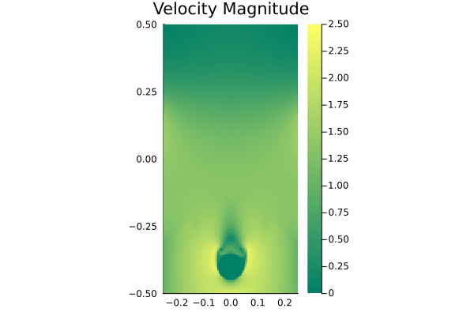
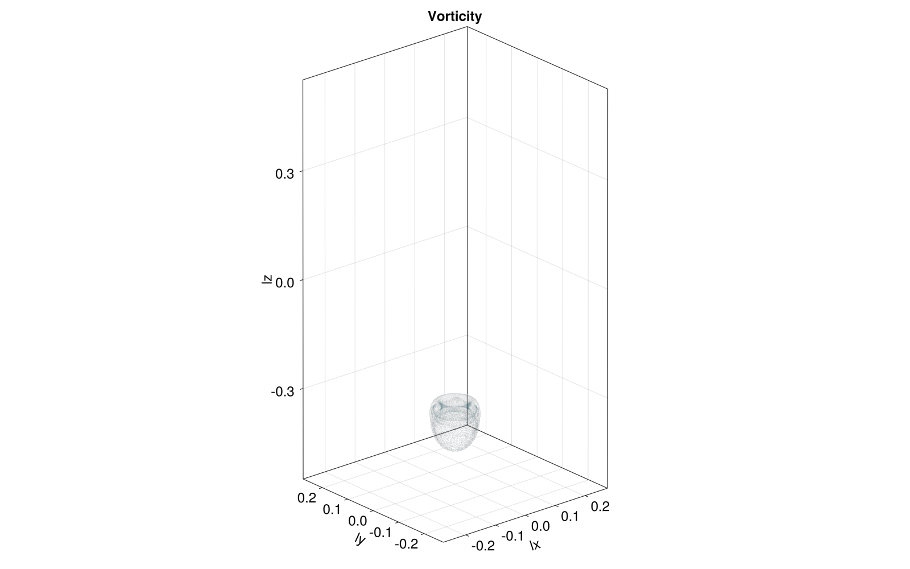
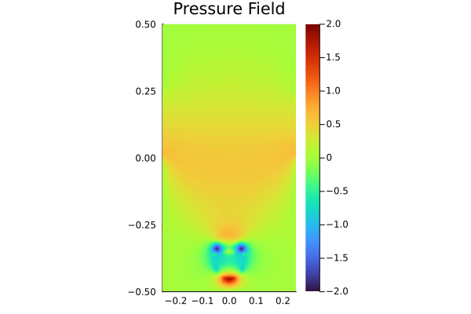
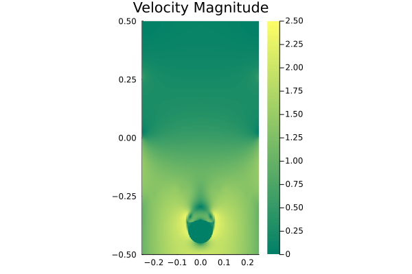
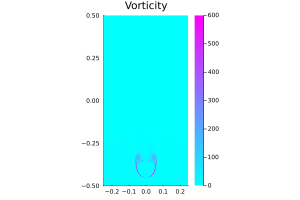
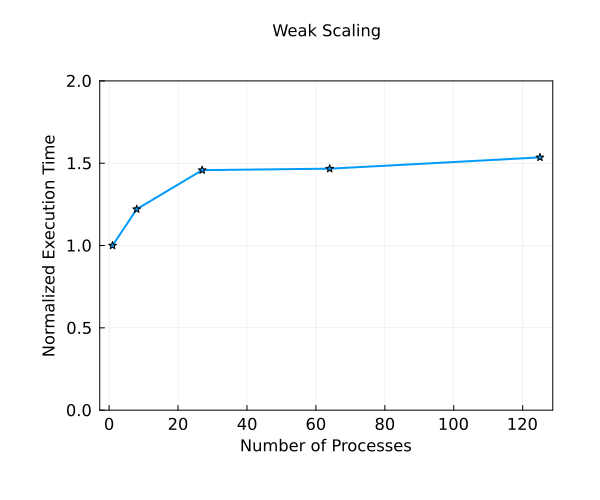

# NavierStokes3D.jl

[](https://github.com/arsh-k/NavierStokes3D.jl/actions/workflows/CI.yml?query=branch%3Aarthur)

NavierStokes3D.jl is a demo developed to simulate flow around a stationary sphere (or cylinder) within a 3D staggered grid domain at different Reynold's numbers. 

## Physical Model (Partial Differential Equations)

The following system of PDEs represent the incompressible Navier-Stokes equations. 

$$
\rho[\frac{\partial \mathbf{V}}{\partial t}+(\mathbf{V} \cdot \nabla \mathbf{V})] =-\nabla p+\mu \nabla^2 \mathbf{V}
$$

$$
\nabla \cdot \mathbf{V} =0
$$

where $t$ is time, $\textbf{V}(\textbf{x},t) = [u,v,w]^T$ is the velocity vector, $p(\textbf{x}, t)$ is the pressure field, $\textbf{x} \in \Omega$ is the spatial coordinate, $\rho$ is the density of the fluid and $\mu$ is the dynamic viscosity of the fluid.

A crucial component for visualizing the vortices around the stationary body is the vorticity. The vorticity components are evaluated as follows:

$$ \omega_x=\frac{\partial w}{\partial y}-\frac{\partial v}{\partial z}$$

$$ \omega_y=-(\frac{\partial u}{\partial z}-\frac{\partial w}{\partial x})$$

$$ \omega_z=\frac{\partial v}{\partial x}-\frac{\partial u}{\partial y}$$

For visualization purposes, we evaluate the magnitude of the vorticity:

$$ 
    |\omega| = \sqrt{\omega_x^2 + \omega_y^2 + \omega_z^2}
$$

## Boundary Conditions

1. **XY plane** - Free slip boundary condition for $u$ and $v$, and $w$ is set to the inlet velocity `vin`. The value for pressure is set to `0.0` on one of the planes (in the physical domain, top of the rectangular box) and the pressure gradient is set to zero on the other plane (bottom of the box).

2. **YZ plane** - Free slip boundary condition for $v$ and $w$, and no-slip boundary condition for $u$. The gradient for pressure is set to zero at both the boundaries of this plane.

3. **XZ plane** - Free slip boundary condition for $u$ and $w$, and no-slip boundary condition for $v$. The gradient for pressure is set to zero at both the boundaries of this plane.

4. The `set_sphere!` function is used to set a no-slip boundary condition on a sphere of radius `0.05` centered at the coordinates $(x, y, z) = (0.0, 0.0, -0.4)$ (additionally, it also sets every grid-point within the sphere to a zero velocity).

## Numerical Method

In order to solve the Navier Stokes PDEs, we implement the Chorin's projection method (operator splitting approach). This method involves the splitting of the velocity updates into separate steps based on the physical components of the Navier-Stokes equation.

We perform an intermediate velocity update using the gravitational and viscous terms of the N-S equations via a simple Explicit Euler timestepping
scheme (in our code, we have utilized a stress-tensor implementation).

$$
\frac{\mathbf{V}^*-\mathbf{V}^n}{\Delta t}= \mu \nabla^2 \mathbf{V}^n - \rho \mathbf{g}
$$

A semi-Lagrangian approach is utilized which helps in streamline backtracking of the velocity via the Explicit Euler scheme and linear interpolation. This accounts for the convective terms present in the equation. This has been implemented in the `advect!` and `backtrack!` functions which use the `lerp` function.

We correct the velocity using the following update:

$$\frac{\mathbf{V}^{n+1}-\mathbf{V}^*}{\Delta t}=-\frac{1}{\rho} \nabla p^{n+1}$$

But for this we require the knowledge of pressure $p$ at $(n+1)$. Here, we exploit the fact that the next iterate of velocity obtained via our update has to be divergence-free as it should satisfy the continuity equation. Hence, we obtain an equation for the pressure at the $(n+1)$ iteration:

$$\nabla^2 p^{n+1}=\frac{\rho}{\Delta t} \nabla \cdot \mathbf{V}^*$$

We then proceed to evaluate the pressure using a pseudo-transient solver. The pseudo-transient solver has been implemented in the `update_dPrdτ!` and `update_Pr!` functions.

## Results 

The simulations have been performed to study the flow around a sphere in a three dimensional domain for a Reynolds number `Re=1e6`. The results for two simulations are presented within the folder `docs`. One simulation has been run on a single GPU and the other on 8 GPU nodes.

### Single GPU simulation 
The lowest resolution has been performed on a single GPU with a grid size of `127*127*255` grid points and `nt=2000` time steps. 

A visualization of the final results of the above mentioned simulation is offered in the following. First, the evolution of vorticity inside the domain is shown via a 3D animation: 



The 3D visualizations for pressure and velocity do not offer much insight. In order to show the evolution of pressure and velocity fields, a longitundinal cross-section through the domain along the x-z plane is considered. The evolution of pressure, velocity and vorticity fields are depicted in the following figures: 






### Multiple XPU simulation

The simulation with the higher resolution (in the folder `multi-gpu-solver-sphere`) has been performed on 8 GPU nodes, for a global grid size of `252*252*508` grid points and `nt=2000` time steps. 

A visualization of the final results of the above mentioned simulation is offered in the following. First, the evolution of vorticity inside the domain is shown via a 3D animation: 



The 3D visualizations for pressure and velocity do not offer much insight. In order to show the evolution of pressure and velocity fields, a longitundinal cross-section through the domain along the x-z plane is considered. The evolution of pressure, velocity and vorticity fields are depicted in the following figures: 







An immediate observation is the increased resolution as compared to the single GPU process. The additional benefit of running the simulation on multiple GPUs is that even for a greater grid size, the execution time roughly remains the same for the same number of kernel calls.

## Weak Scaling

The figure below indicates the normalized execution time as a function of the number of processes. It is observed that even as the global domain size increases as the number of processes increase there is a minor increase in execution time compared to a single process. The minor increase in execution time is due to communication between the multiple GPU nodes via `update_halo!` macro. 



To visualize the implications of weak scaling, we had to keep a fixed value of `nt` and `niter` within our weak scaling implementation. This ensures that the number of kernel calls are same for all multi-gpu configurations and remain unaffected by the time step size. The weak scaling implementation is provided in `navier_stokes_3d_multixpu_weak_scaling.jl` and the batch script for the same is provided in `navier_stokes_weak_scaling.sh`.

## Running the software
**NOTE**: To run any simulation on a CPU process, one has to change the variable `USE_GPU` to `false` in the Julia scripts.

The simulation scripts are provided in the `scripts` folder. To launch a simulation locally on CPU processes, the following procedure can be followed (creating a subfolder for saving the outputs at provided stamps): 

```
cd scripts
mkdir out_vis_all
julia --project
include("navier_stokes_3d_multixpu_sphere.jl")
```

Otherwise, a GPU process can also be launched on a single GPU node: 

```
cd scripts
mkdir out_vis_all
sbatch navier_stokes_xpu.sh
```

If the simulation wants to be launched on multiple GPU nodes, a similar procedure can be applied in order to run the baseline simulation on 8 GPUs for 2000 timesteps: 

```
cd scripts
mkdir out_vis_all
sbatch navier_stokes_multixpu.sh
```

Finally, if one wishes to check if our simulation runs as expected, the procedure would be (activating the testing environment): 

```
cd test
julia
import Pkg
Pkg.activate('.')
Pkg.instantiate()
include("runtests.jl")
``` 

## Visualization

The scripts for visualizing the results of the multi-XPU and XPU configurations have been provided in the `visualization` folder. Note that for all the scripts the following variables must be changed according to the simulation performed:

1. `nt` - Number of times data files for pressure and velocity were saved during the simulation.
2. `frames` - The number of iterations between each data file save.

Currently, these have been set according to the simulations performed in the `scripts` folder.